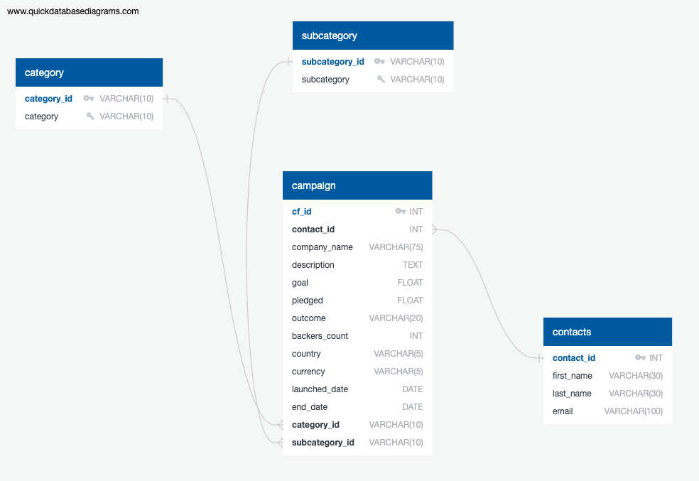

# Project 2: Crowdfunding_ETL

  

## Overview and Purpose of the Project 
The project aims to build an ETL (Extract, Transform, and Load) pipeline using Python dictionary methods and regular expressions to extract and transform data obtained from a crowdfunding database comprising 1,000 campaigns launched at different months within a given year concerning funding goals and the number of backers or donors.

## Methods 
Four DataFrames were extracted from the crowdfunding.xlsx data. 

* **Category and Subcategory DataFrames**: created by pulling a "category_id" and "category" columns that contain entries going sequentially from "cat1" to "cat*n*," where *n* is the number of unique categories and related titles, respectively. Category DataFrame was then saved into a GitHub repository. Subcategory DataFrame was also created by pulling the "subcategory_id" and "subcategory" columns and stored in a GitHub repository. 

* **Campaign DataFrame**: created by pulling "cf_id," "contact_id," "company_name," "blurb" - renamed to "description," "goal" - converted to the float data type,  "pledged" - converted to the float data type, "outcome," "backers_count," "country," "currency," "launched_at" column - renamed to "launch_date" and with the UTC times converted to the datetime format, "deadline" column - renamed to "end_date" and with the UTC times converted to the datetime format, "category_id" column, with unique identification numbers matching those in the "category_id" column of the category DataFrame, and "subcategory_id" column, with the unique identification numbers matching those in the "subcategory_id" column of the subcategory DataFrame. Campaign DataFrame was then saved into GitHub. 

* **Contacts DataFrame**: created using Python dictionary methods and regular expressions. Contacts DataFrame was then saved into GitHub.

* **Crowdfunding Database**: created by sketching the four CSV files using QuickDBD and using the information from the ERD to create a table schema for each CSV file. The database schema was then saved as a Postgres file into GitHub. A new Postgres database was created to arrange the tables correctly to handle foreign keys. A SELECT statement was applied to verify the data in each table. 

  

## Conclusion
* Although Excel is a powerful tool that can be utilized for quick data analysis, using Python dictionaries to extract and transform data decreases computational time while increasing efficiency. Postgres is most powerful for pulling, filtering, updating, and combining large datasets without introducing miscalculations and data errors. 
